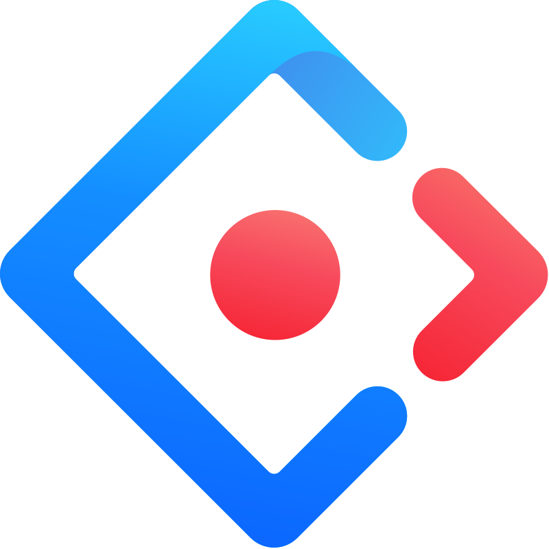

    <h1>
    Hi there , I'm a Front-End Developer
    </h1>

   

   
### About Me:

#### I have 3+ years of experience in front-end development, including 2+ years of commercial experience in developing web applications for a banking software platform using React.js, and building websites with Next.js. I have successfully made impactful contributions to projects and have been involved in developing architecture from scratch on projects.

###

### Projects I've worked on:

#### PayGears Corporation:

#### [paygears.com](https://paygears.com/) — The official website of **PayGears Corporation**, a company that helps businesses build and launch financial products. Built with **Next.js** for server-side rendering, styled components, and enhanced with **Lottie animations** for a dynamic user experience.

#### [docs.paygears.com](https://docs.paygears.com/) — The official **documentation portal** for PayGears Corporation. Built using **McDocs (HTML, CSS)** for a structured and intuitive layout.

#### [Web platforms to Open Banking APIs](https://paygears.com/open-banking-api) — A **dedicated platforms** for Open Banking API solutions, which enables businesses to connect with financial institutions, payment providers, and banking services. The platforms are developed using **React.js, TypeScript, MobX, Styled Components, and Ant Design**, following the **Feature-Sliced Design (FSD) architecture** to ensure modularity, scalability, and maintainability.

#### [Payment Links](https://paygears.com/news/payment-link-news) — A **payment link** is a simple way for merchants to request payments online through a clickable link, button, or QR code. Developed using **React.js, TypeScript, MobX, Styled Components, and Ant Design**, following the **Feature-Sliced Design (FSD) architecture** for scalability and maintainability.

###

### Tech Stack:

<table align="center">
  <tr>
     <td align="center"  width="88">
         
       HTML5
    </td>
    <td align="center" width="88">
        
       CSS3
    </td>
    <td align="center" width="88">
         
       Sass
    </td>
    <td align="center" width="88">
        
       Styled Components
    </td>
    <td align="center" width="88"> 
        
       Ant Design
    </td>
    <td align="center"  width="88">
        
       Tailwind
    </td>
    <td align="center" width="88">
      
       Bem
    </td>
        <td align="center" width="88">
       
       Material.js
      </td>
      <td align="center" width="88">
        
       Figma
    </td>
  </tr>
  <tr>
    <td align="center" width="88">
    
       JavaScript
    </td>
    <td align="center" width="88">
    
       TypeScript
    </td>
    <td align="center" width="88">
        
       React.js
    </td>
    <td align="center" width="88">
        
       Next.js
    </td>
    <td align="center" width="88">
      
       Svelte
    </td>
        <td align="center" width="88">
       
       MobX
      </td>
      <td align="center" width="88">
      
       Redux
     </td>
  <td align="center" width="88">
  
       Visual Studio Code
     </td>
  <td align="center" width="88">
  
       WebStorm
     </td>
</tr>
<tr>
     <td align="center"  width="88">
     
       Node.js
    </td>
    <td align="center" width="88">
    
       MongoDB
    </td>
    <td align="center" width="88">
    
       Axios
    </td>
<td align="center" width="88">

       Vite
    </td>
    <td align="center" width="88">
    
       Gulp
    </td>
    <td align="center" width="88">
    
       GSAP
    </td>
    <td align="center" width="88">
    
       Lottie
    </td>
        <td align="center" width="88">
        
       Jira
      </td>
      <td align="center" width="88">
      
       Git
    </td>
  </tr>
</table>

###

### GitHub Stats :

<table align="center" style="overflow:visible">
  <tr>
  <td>
  
  </td>
  <td>
  
  </td>
  </tr>
  <tr>
</table>

###

### 📩 You can contact me!

